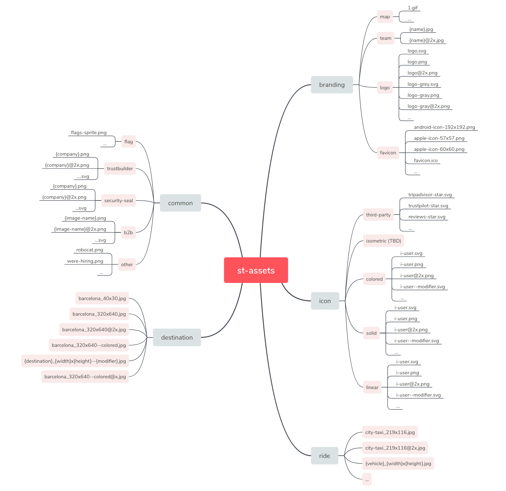
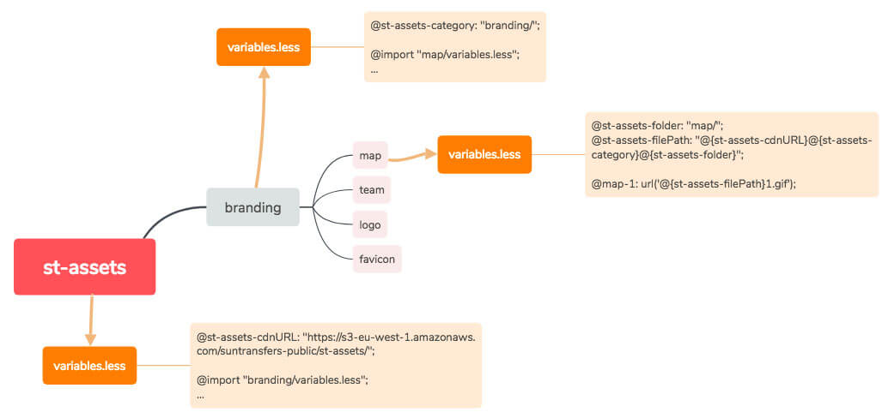

# Images in S3

## Structure in S3

!&gt; Having an unique structure and URLs for images helps the web performance, the maintainability and the scalability in Suntransfers' products.

## CSS Variables

We include .scss and .less files to import all the variables in the projects. This compilable files won't include any single line of code to compile in a CSS class, just variables to be imported.

