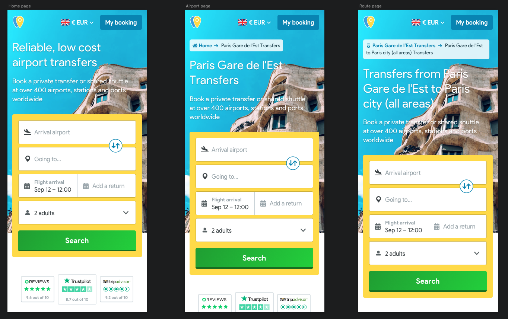

# Breadcrumb

## Standard implementation


The _**Breadcrumb**_ displays the name of the current page and a link to its parent.


The parent will display the icon related to the type of gateway. In the case of the homepage, we will display a house.


I think we're doing it wrong, because imho we should have something like Italy - Rome - Fiumicino.


### Mobile

### Tablet

### Desktop

