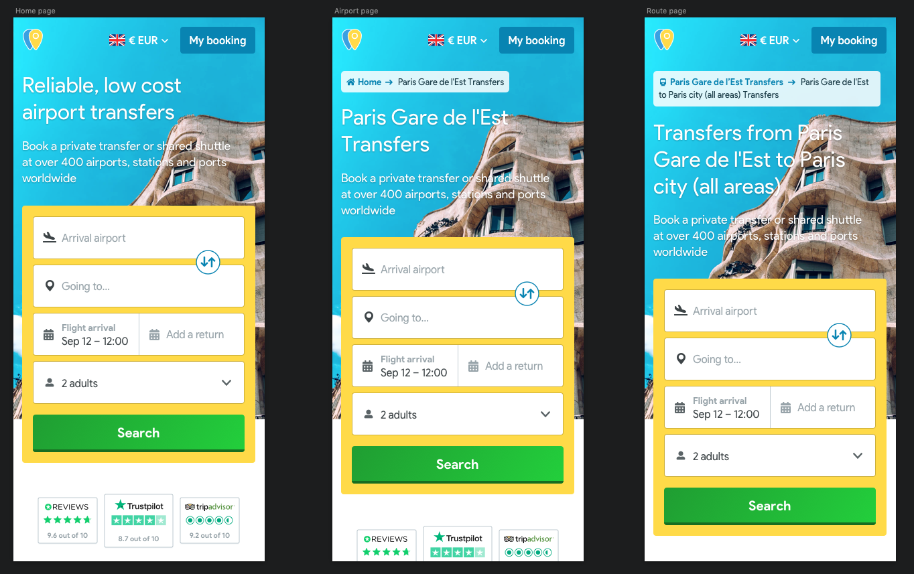

!> The ***Breadcrumb*** displays the name of the current page and a link to its parent.

# Standard implementation
The parent will display the icon related to the type of gateway. In the case of the homepage, we will display a house.

?> I think we're doing it wrong, because imho we should have something like Italy - Rome - Fiumicino.  

 

## Mobile
## Tablet
## Desktop