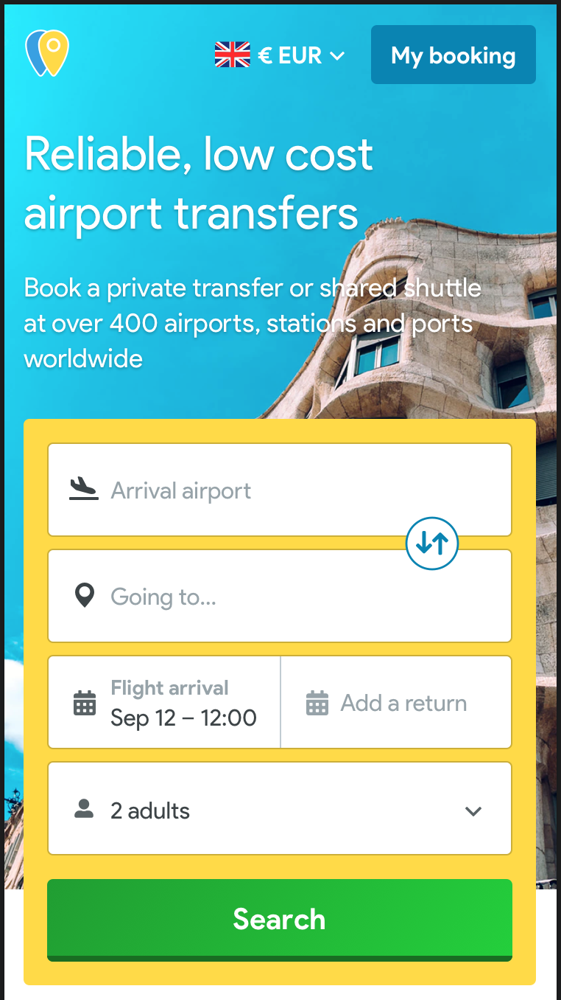

# Hero

## Standard implementation


The _**Hero**_ displays the top of the page in the landing pages.


It's a component with several components inside and configuration element for the content.

### Hero component structure

* The header, with:
  * Logo
  * Menu
    * _"language and currencies"_ component
    * My booking link
* "Breadcrumb" component
* A editable title \(h1\)
* A editable description \(h2\)
* A editable background image
* The "searchForm" component

  **Background image**

  ?&gt; We need a way to modify the background image depending on the landing page, grouping them \(for example, same picture for all the airports in London\) or change the images directly if we want to create a campaign with a different image for a specific page. All of them will be hosted in S3.

* It will always have a "alt" text. The content has to be the "title" of the page

### Mobile

### Tablet

### Desktop

