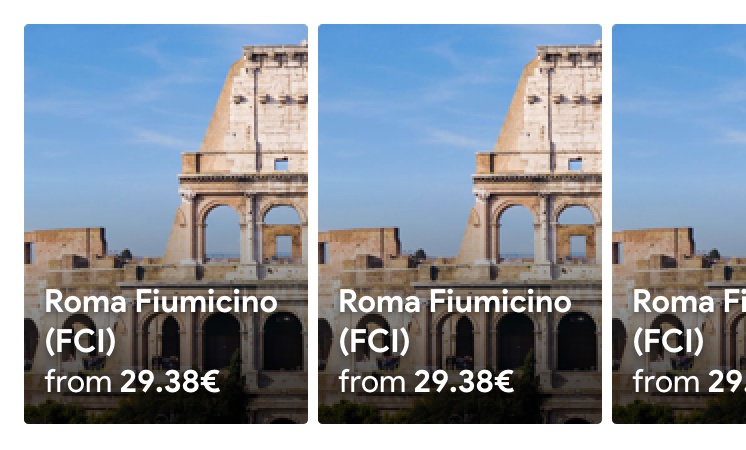

# Images List

## Standard implementation


_**Images list**_ displays cards horizontally through a lateral scroll within a title, a description and a background.


These _images_ will include:

* Title
* Price
* Background. We will have a default image in case we can't find the image or it's not passed. The alt of the image will be the "Title"
* Link to the page

When the user clicks an _image_, it will open _a new page_.

## Price From

In the past, we were using the price per person. But we won't use it anymore. We will use the cheapest price in the destination, in the same frame of time as we're doing now, but following this pattern:

* Cheapest entire private car or
* Cheapest shuttle for one pax.

### Mobile

The basic implementation for small screens will include _up to 10 elements_. It can be modified.

### Tablet

### Desktop

### CSS implementation

* The entire element must be clickable.

