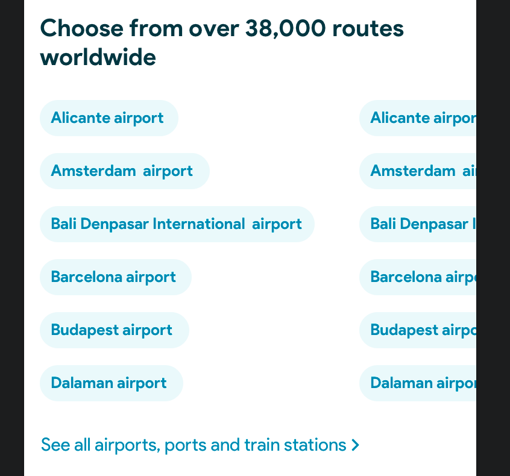

# Link Wall

## Standard implementation


A list of links distributed evenly, with vertical order, in columns


The component will have: 1. A title 1. The list of links, distributed by the component and horizontally scrollable 1. A general link below the list

