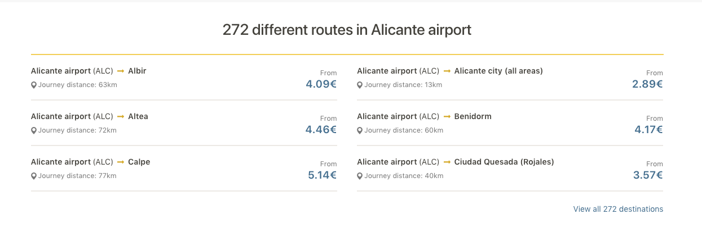

# Popular Products

## Popular products


We will use mostly the same as we're using now


## Price From

In the past, we were using the price per person. But we won't use it anymore. We will use the cheapest price in the destination, in the same frame of time as we're doing now, but following this pattern:

* Cheapest entire private car or
* Cheapest shuttle for one pax.

