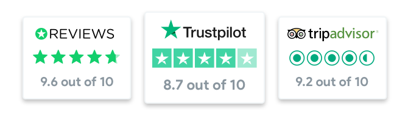

!> ***Reviews brief*** enables users to quickly have an overview of the value of the service from 3rd party companies.

# Standard implementation

This _banners_ will include the:
 - Logo of the reviewer
 - Rating in a value from 0 to 5 with icons. Specific for each reviewer
 - Rating in a value from 0 to 10 in text

When the user clicks in a _banner_, it will open it in a _new tab_.

The possible reviewers are:
 - Trustpilot
 - Tripadvisor
 - Google
 - Reviews
 - Review Centre
 
## Mobile
The basic implementation for small screens include the reviews from Trustpilot, Tripadvisor and Reviews.

## Tablet
## Desktop

## CSS implementation
 - -webkit-tap-highlight-color has to be included
