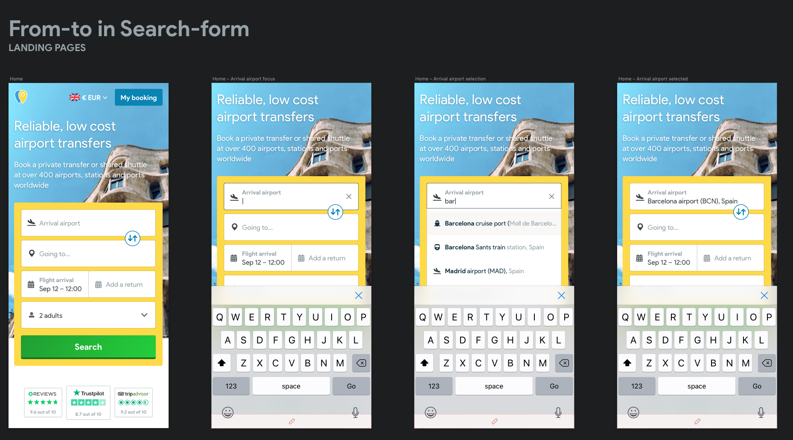
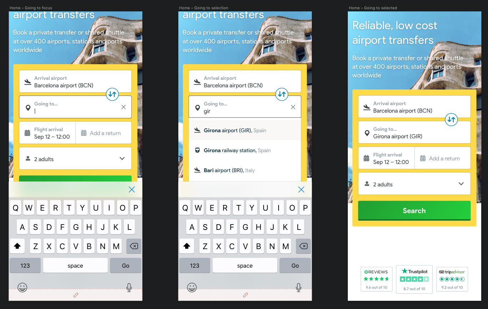
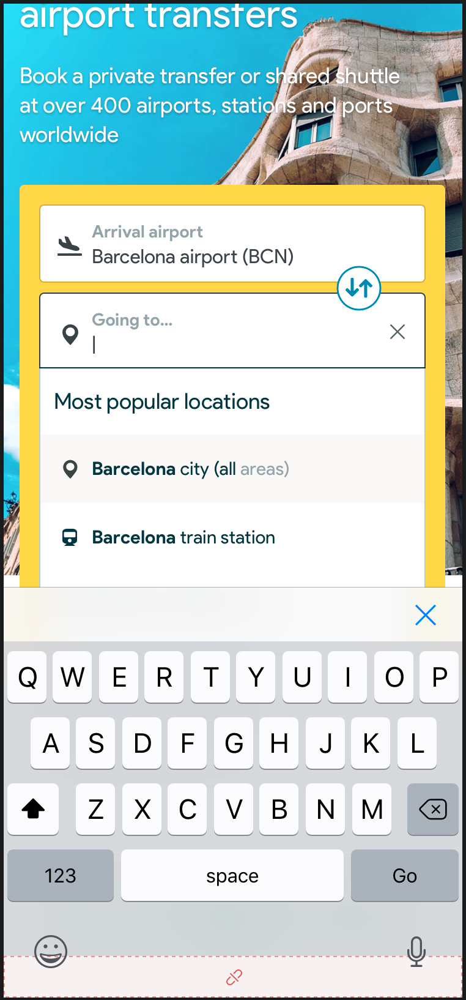
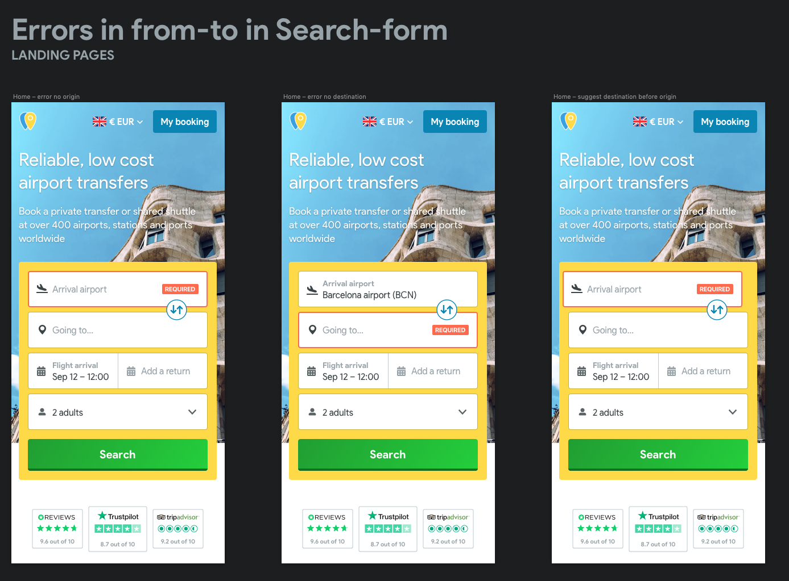
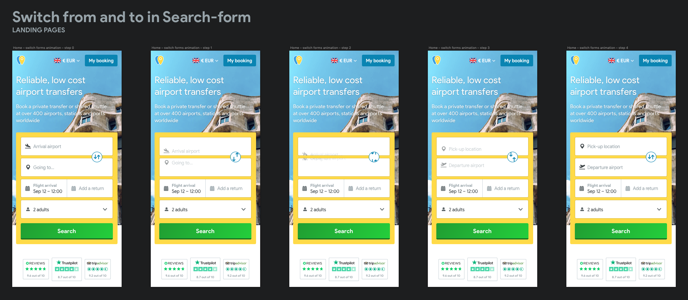
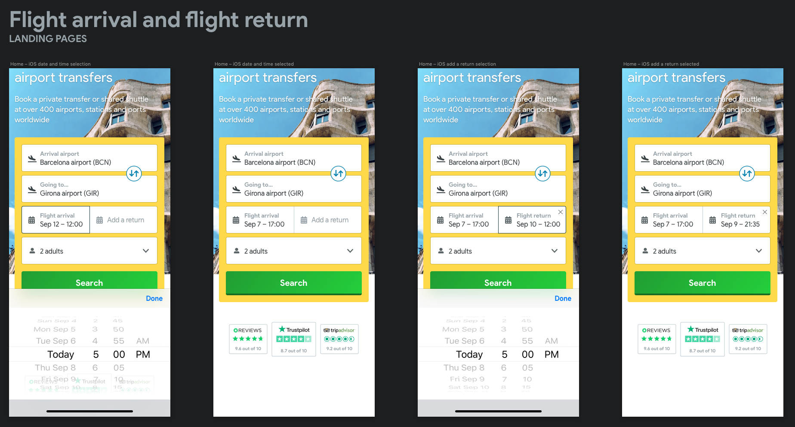
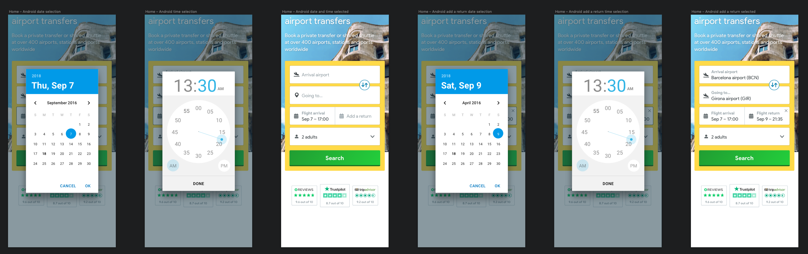
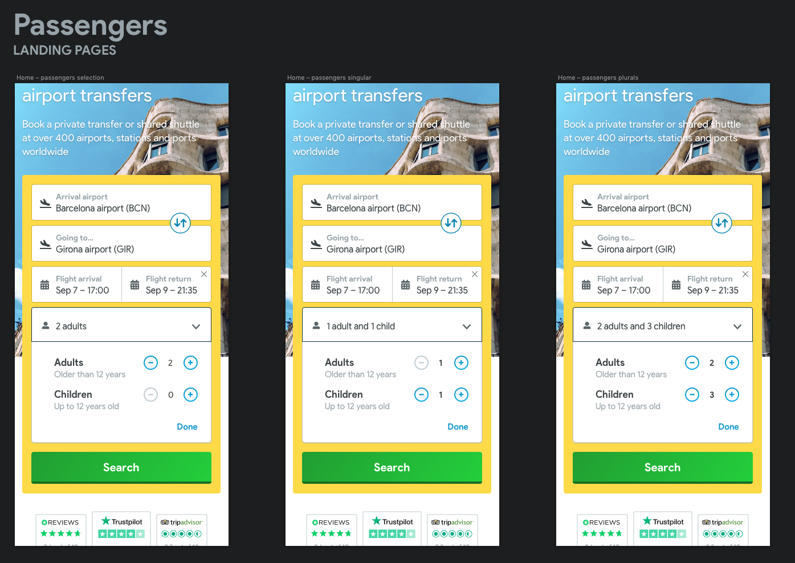

# searchForm

!&gt; Improve the interaction and CTR in the landing pages.

## Implementation

1. All the fields will display a popover relative to the content, not floating

## From and To fields behaviour

1. The inputs display a drop-down with destinations **after typing more than two letters**. Tapping over a destination prefills it, as it does pressing Enter or Go. You can navigate through the drop-downs with the keyboard
2. At any scenario with less than 3 letters, we won't show the drop-down
3. **These inputs do not allow free writing:** they have to be filled with content from the popover. Clicking outside without making a selection will choose the first element shown \(and highlighted in grey\) or nothing if there is no results.
4. We won't show more than 5 elements in the list
5. We will highlight the content written in the input in the drop-downs. We will highlight entire word with the text written \(input: Bar, highlight words: Barcelona, Bariloche, …\)

 

## To field if we keep the current Search-form

1. Show the most popular locations once the user clicks in the To field \(and the first element is already filled\)

   

### Errors

1. If the `Origin` and `Destination` fields are left blank when submitting the form we will show the error in the first one.
2. Leaving an input blank should only trigger an error when the form is submitted.
3. **SPECIAL CASE, only if GPlaces is not implemented** Trying to focus on the `Destination` field before the `Origin` field is filled triggers the `REQUIRED` error on the `Origin` field: we center the `Origin` field and we shake it so the user is directed to fill it first.
4. When an error triggers, the input border turns red and a `REQUIRED` label appears to the right.
5. When an input gets focused the error disappears.

### Switch from and to behaviour

1. Clicking the switch button should trigger a fast animation to make clear that the order of the fields is inverted.
2. If the fields are filled with valid content, they will remain the same.
3. If the fields are half-filled or have errors, they will reset and appear blank just before the animation starts.

[filename](https://github.com/miriamcastellon/st-design/tree/99718b5c0f94642adcc71ce0bb04edaf57a88780/docs/pages/components/searchForm/switchAnimation.mp4)

## Native dates and times

### Implementation

1. We prefill the date input with the date depending on the day of the week:
   * From Saturday to Thursday: prefilled to Friday at 12:00
   * Friday: Saturday at 12:00   
2. The return will be only active if the user clicks in it. Additionally, they can _clean_ this return clicking in the X
3. This return will be prefilled 3 days after the outward, at 12:00 too
4. This entire configuration has to be passed to the component

### iOS date selection

1. We use the native iOS datetime picker.

### Android date selection

1. We use the native Android date picker and time picker, so it requires one step more than iOS. Would be nice if it could be chained, so exiting date selection could trigger time selection.
2. If possible, we will have tappable part that will open only the timepicker.

### Passengers input

1. By default, the selection is `2 adults`. Selecting the field to change it will display a popover with a double selector for adults and children.
2. You can not select less than one adult.
3. You can select 0 or more children.
4. The descriptive label of the selection must take into account singular and plural forms of the words: `1 adult and 2 children` or `2 adults and 1 child`.
5. If no children are selected the descriptive label should only display the necessary words: `3 adults`.
6. Tapping outside the popover or clicking `Done` should leave the selection as it is.

