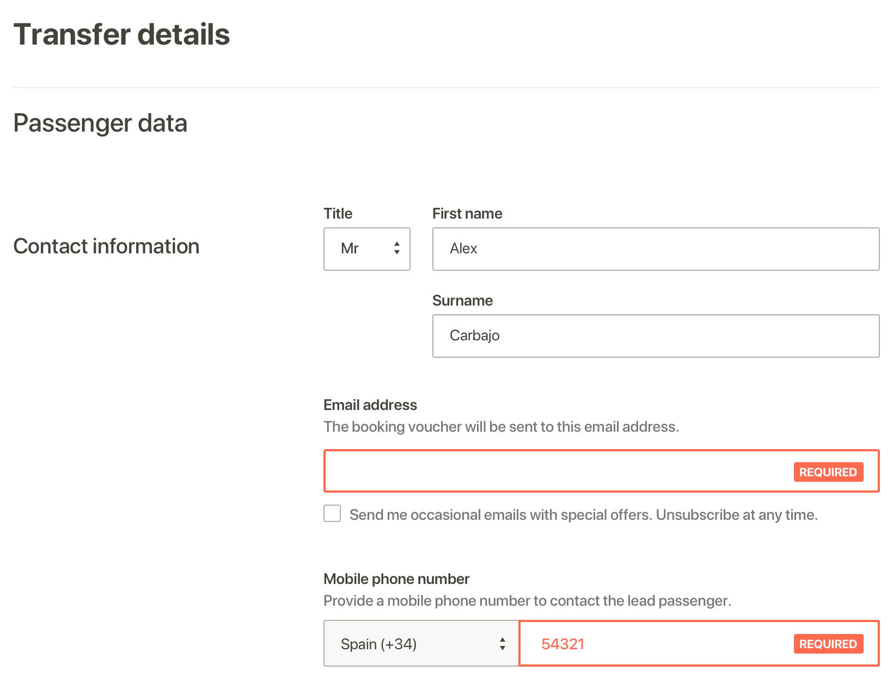

# Form Errors

## Task

Losing focus on an input form with a blank value immediately triggers the `required` error. Is it best to show all errors on submit or display and correct them one by one?

1. Every input should check when losing focus if the data entered is correct. If it isn't, it should trigger an error.
2. Leaving an input blank should only trigger an error when the form is submitted.
3. When an error triggers, the input border turns red and a `REQUIRED` label appears to the right.
4. When an input gets focused the error disappears.

