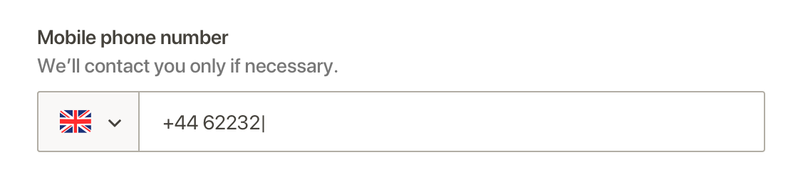
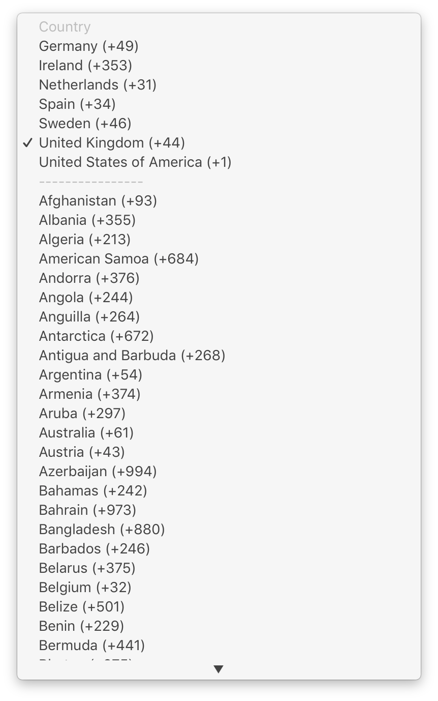

# mobile-dropdown

## Task

Display the country's flag instead of the name when the mobile phone number dropdown is folded to avoid cutting off the name as happens now. Add the country's prefix directly in the input form as non-editable information to clarify what information is selected.

1. The mobile phone number dropdown displays the flag of the selected country when is folded.
2. The mobile phone number input displays the country prefix number of the selected country as non-editable information. The input is editable one space after the prefix.
3. The dropdown contains the same information and grouping as it does now: name of country \(+phone prefix number\).
4. Selecting a country in the dropdown should focus the phone number input.
5. Consider using the `optgroup` tag with adequate labels to improve usability and code quality. Example code pasted below.

### Folded mobile phone number dropdown



### Current mobile phone number dropdown information grouping



### Optgroup example code

```text
<optgroup label="Selected countries">
<option value="de">Germany (+49)</option>
<option value="ie">Ireland (+353)</option>
<option value="nl">Netherlands (+31)</option>
<option value="es">Spain (+34)</option>
<option value="se">Sweden (+46)</option>
<option value="gb">United Kingdom (+44)</option>
<option value="us">United States of America (+1)</option>
</optgroup>
<optgroup label="All countries">
<option value="af">Afghanistan (+93)</option>
<option value="al">Albania (+355)</option>
<option value="dz">Algeria (+213)</option>
<option value="as">American Samoa (+684)</option>
<option value="ad">Andorra (+376)</option>
<option value="ao">Angola (+244)</option>
<option value="ai">Anguilla (+264)</option>
<option value="aq">Antarctica (+672)</option>
<option value="ag">Antigua and Barbuda (+268)</option>
<option value="ar">Argentina (+54)</option>
<option value="am">Armenia (+374)</option>
<option value="aw">Aruba (+297)</option>
<option value="au">Australia (+61)</option>
<option value="at">Austria (+43)</option>
<option value="az">Azerbaijan (+994)</option>
<option value="bs">Bahamas (+242)</option>
<option value="bh">Bahrain (+973)</option>
<option value="bd">Bangladesh (+880)</option>
<option value="bb">Barbados (+246)</option>
<option value="by">Belarus (+375)</option>
<option value="be">Belgium (+32)</option>
<option value="bz">Belize (+501)</option>
<option value="bj">Benin (+229)</option>
<option value="bm">Bermuda (+441)</option>
<option value="bt">Bhutan (+975)</option>
<option value="bo">Bolivia (+591)</option>
<option value="ba">Bosnia and Herzegovina (+387)</option>
<option value="bw">Botswana (+267)</option>
<option value="bv">Bouvet Island ()</option>
<option value="br">Brazil (+55)</option>
<option value="io">British Indian Ocean Territory (+246)</option>
<option value="bn">Brunei Darussalam (+673)</option>
<option value="bg">Bulgaria (+359)</option>
<option value="bf">Burkina Faso (+226)</option>
<option value="bi">Burundi (+257)</option>
<option value="kh">Cambodia (+855)</option>
<option value="cm">Cameroon (+237)</option>
<option value="ca">Canada (+1)</option>
<option value="cv">Cape Verde (+238)</option>
<option value="ky">Cayman Islands (+345)</option>
<option value="cf">Central African Republic (+236)</option>
<option value="td">Chad (+235)</option>
<option value="cl">Chile (+56)</option>
<option value="cn">China (+86)</option>
<option value="cx">Christmas Island (+53)</option>
<option value="cc">Cocos (Keeling) Islands (+61)</option>
<option value="co">Colombia (+57)</option>
<option value="km">Comoros (+269)</option>
<option value="cd">Congo, Democratic Republic of (+243)</option>
<option value="cg">Congo (+242)</option>
<option value="ck">Cook Islands (+682)</option>
<option value="cr">Costa Rica (+506)</option>
<option value="hr">Croatia (+385)</option>
<option value="cu">Cuba (+53)</option>
<option value="cw">Curaçao (+599)</option>
<option value="cy">Cyprus (+357)</option>
<option value="cz">Czech Rep. (+420)</option>
<option value="ci">Côte d’Ivoire (+225)</option>
<option value="dk">Denmark (+45)</option>
<option value="dj">Djibouti (+253)</option>
<option value="dm">Dominica (+767)</option>
<option value="do">Dominican Republic (+1829)</option>
<option value="ec">Ecuador (+593)</option>
<option value="eg">Egypt (+20)</option>
<option value="sv">El Salvador (+503)</option>
<option value="gq">Equatorial Guinea (+240)</option>
<option value="er">Eritrea (+291)</option>
<option value="ee">Estonia (+372)</option>
<option value="et">Ethiopia (+251)</option>
<option value="fk">Falkland Islands (Malvinas) (+500)</option>
<option value="fo">Faroe Islands (+298)</option>
<option value="fj">Fiji (+679)</option>
<option value="fi">Finland (+358)</option>
<option value="fr">France (+33)</option>
<option value="gf">French Guiana (+594)</option>
<option value="pf">French Polynesia (+689)</option>
<option value="ga">Gabon (+241)</option>
<option value="gm">Gambia (+220)</option>
<option value="ge">Georgia (+995)</option>
<option value="de">Germany (+49)</option>
<option value="gh">Ghana (+233)</option>
<option value="gi">Gibraltar (+350)</option>
<option value="gr">Greece (+30)</option>
<option value="gl">Greenland (+299)</option>
<option value="gd">Grenada (+1473)</option>
<option value="gp">Guadeloupe (+590)</option>
<option value="gu">Guam (+671)</option>
<option value="gt">Guatemala (+502)</option>
<option value="gw">Guinea-Bissau (+245)</option>
<option value="gn">Guinea (+224)</option>
<option value="gy">Guyana (+592)</option>
<option value="ht">Haiti (+509)</option>
<option value="hm">Heard Island and McDonald Islands ()</option>
<option value="va">Holy See (Vatican City State) (+39)</option>
<option value="hn">Honduras (+504)</option>
<option value="hk">Hong Kong (+852)</option>
<option value="hu">Hungary (+36)</option>
<option value="is">Iceland (+354)</option>
<option value="in">India (+91)</option>
<option value="id">Indonesia (+62)</option>
<option value="ir">Iran (+98)</option>
<option value="iq">Iraq (+964)</option>
<option value="ie">Ireland (+353)</option>
<option value="im">Isle of Man (+44)</option>
<option value="il">Israel (+972)</option>
<option value="it">Italy (+39)</option>
<option value="jm">Jamaica (+876)</option>
<option value="jp">Japan (+81)</option>
<option value="jo">Jordan (+962)</option>
<option value="kz">Kazakhstan (+7)</option>
<option value="ke">Kenya (+254)</option>
<option value="ki">Kiribati (+686)</option>
<option value="kr">Korea, Rep. of (+82)</option>
<option value="xk">Kosovo, Republic of (+381)</option>
<option value="kw">Kuwait (+965)</option>
<option value="kg">Kyrgyzstan (+996)</option>
<option value="la">Laos (+856)</option>
<option value="lv">Latvia (+371)</option>
<option value="lb">Lebanon (+961)</option>
<option value="ls">Lesotho (+266)</option>
<option value="lr">Liberia (+231)</option>
<option value="ly">Libya (+218)</option>
<option value="li">Liechtenstein (+423)</option>
<option value="lt">Lithuania (+370)</option>
<option value="lu">Luxembourg (+352)</option>
<option value="mo">Macao (+853)</option>
<option value="mk">Macedonia, Rep. of (+389)</option>
<option value="mg">Madagascar (+261)</option>
<option value="mw">Malawi (+265)</option>
<option value="my">Malaysia (+60)</option>
<option value="mv">Maldives (+960)</option>
<option value="ml">Mali (+223)</option>
<option value="mt">Malta (+356)</option>
<option value="mh">Marshall Islands (+692)</option>
<option value="mq">Martinique (+596)</option>
<option value="mr">Mauritania (+222)</option>
<option value="mu">Mauritius (+230)</option>
<option value="yt">Mayotte (+269)</option>
<option value="mx">Mexico (+52)</option>
<option value="fm">Micronesia, Federated States of (+691)</option>
<option value="md">Moldova, Republic of (+373)</option>
<option value="mc">Monaco (+377)</option>
<option value="mn">Mongolia (+976)</option>
<option value="me">Montenegro (+382)</option>
<option value="ms">Montserrat (+664)</option>
<option value="ma">Morocco (+212)</option>
<option value="mz">Mozambique (+258)</option>
<option value="mm">Myanmar (+95)</option>
<option value="na">Namibia (+264)</option>
<option value="nr">Nauru (+674)</option>
<option value="np">Nepal (+977)</option>
<option value="nl">Netherlands (+31)</option>
<option value="nc">New Caledonia (+687)</option>
<option value="nz">New Zealand (+64)</option>
<option value="ni">Nicaragua (+505)</option>
<option value="ne">Niger (+227)</option>
<option value="ng">Nigeria (+234)</option>
<option value="nu">Niue (+683)</option>
<option value="nf">Norfolk Island (+672)</option>
<option value="mp">Northern Mariana Islands (+670)</option>
<option value="no">Norway (+47)</option>
<option value="om">Oman (+968)</option>
<option value="pk">Pakistan (+92)</option>
<option value="pw">Palau (+680)</option>
<option value="ps">Palestinian Territory, Occupied (+970)</option>
<option value="pa">Panama (+507)</option>
<option value="pg">Papua New Guinea (+675)</option>
<option value="py">Paraguay (+595)</option>
<option value="pe">Peru (+51)</option>
<option value="ph">Philippines, Rep. of the (+63)</option>
<option value="pn">Pitcairn Islands (+872)</option>
<option value="pl">Poland (+48)</option>
<option value="pt">Portugal (+351)</option>
<option value="pr">Puerto Rico (+1787)</option>
<option value="qa">Qatar (+974)</option>
<option value="re">Reunion (+262)</option>
<option value="ro">Romania (+40)</option>
<option value="ru">Russia (+7)</option>
<option value="rw">Rwanda (+250)</option>
<option value="sh">Saint Helena (+290)</option>
<option value="kn">Saint Kitts and Nevis (+869)</option>
<option value="lc">Saint Lucia (+758)</option>
<option value="mf">Saint Martin (French part) (+590)</option>
<option value="pm">Saint Pierre and Miquelon (+508)</option>
<option value="vc">Saint Vincent and the Grenadines (+784)</option>
<option value="ws">Samoa (+685)</option>
<option value="sm">San Marino (+378)</option>
<option value="st">Sao Tome and Principe (+239)</option>
<option value="sa">Saudi Arabia (+966)</option>
<option value="sn">Senegal (+221)</option>
<option value="rs">Serbia (+381)</option>
<option value="sc">Seychelles (+248)</option>
<option value="sl">Sierra Leone (+232)</option>
<option value="sg">Singapore (+65)</option>
<option value="sx">Sint Maarten (Dutch part) (+599)</option>
<option value="sk">Slovakia (+421)</option>
<option value="si">Slovenia (+386)</option>
<option value="sb">Solomon Islands (+677)</option>
<option value="so">Somalia (+252)</option>
<option value="za">South Africa (+27)</option>
<option value="gs">South Georgia and the South Sandwich Islands (+998)</option>
<option value="es">Spain (+34)</option>
<option value="lk">Sri Lanka (+94)</option>
<option value="sd">Sudan (+249)</option>
<option value="sr">Suriname (+597)</option>
<option value="sj">Svalbard and Jan Mayen (+79)</option>
<option value="sz">Swaziland (+268)</option>
<option value="se">Sweden (+46)</option>
<option value="ch">Switzerland (+41)</option>
<option value="sy">Syrian Arab Republic (+963)</option>
<option value="tw">Taiwan, Province of China (+886)</option>
<option value="tj">Tajikistan (+992)</option>
<option value="tz">Tanzania, United Republic of (+255)</option>
<option value="tf">Territory of the French Southern and Antarctic Lands ()</option>
<option value="th">Thailand (+66)</option>
<option value="tl">Timor-Leste (+670)</option>
<option value="tg">Togo (+228)</option>
<option value="tk">Tokelau (+690)</option>
<option value="to">Tonga (+676)</option>
<option value="tt">Trinidad and Tobago (+868)</option>
<option value="tn">Tunisia (+216)</option>
<option value="tr">Turkey (+90)</option>
<option value="tm">Turkmenistan (+993)</option>
<option value="tc">Turks and Caicos Islands (+649)</option>
<option value="tv">Tuvalu (+688)</option>
<option value="ug">Uganda (+256)</option>
<option value="ua">Ukraine (+380)</option>
<option value="ae">United Arab Emirates (+971)</option>
<option value="gb">United Kingdom (+44)</option>
<option value="um">United States Minor Outlying Islands (+808)</option>
<option value="us">United States of America (+1)</option>
<option value="uy">Uruguay (+598)</option>
<option value="uz">Uzbekistan (+998)</option>
<option value="vu">Vanuatu (+678)</option>
<option value="ve">Venezuela, Bolivarian Republic of (+58)</option>
<option value="vn">Vietnam (+84)</option>
<option value="vg">Virgin Islands, British (+284)</option>
<option value="vi">Virgin Islands, U.S. (+340)</option>
<option value="wf">Wallis and Futuna (+681)</option>
<option value="eh">Western Sahara (+212)</option>
<option value="ye">Yemen (+967)</option>
<option value="zm">Zambia (+260)</option>
<option value="zw">Zimbabwe (+263)</option>
</optgroup>
```

