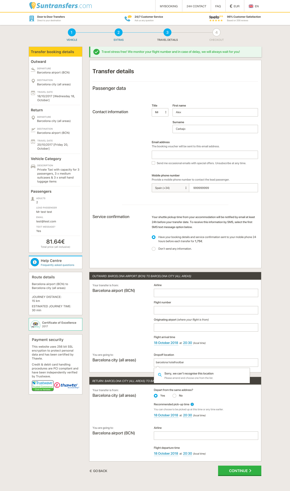

# Passenger data

## Task

Reorder, visual refinement and rewording of the passenger data form.

1. Ask for the email address before requesting the phone number.
1. Renaming and integration of the _Service information_ section to clarify the SMS message option.
1. Add shuttle information text in the _Service information_ section where it belongs.

### Passenger data form

### Passenger data form with shuttle info

