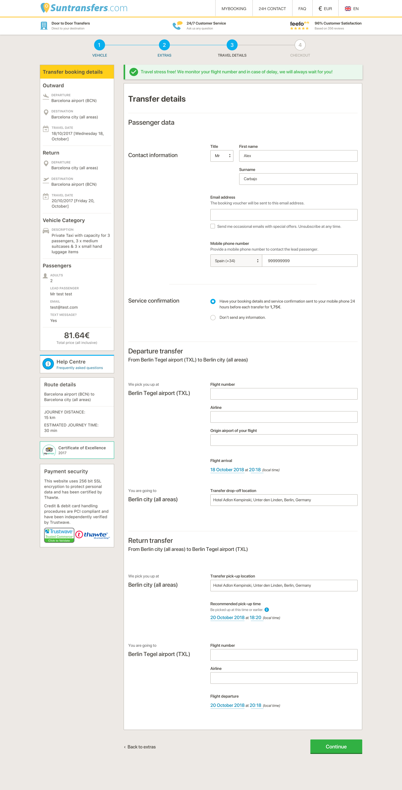

# transfer-details

## Task

Reorder, visual refinement and rewording of the transfer details form.

1. It has two clearly titled _Departure transfer_ and _Return transfer_ sections.
2. We prioritize asking for the flight number in the first place when it's possible.
3. The information filled by the user in the _Transfer drop-off location_ input is copied automatically to the _Transfer pick-up location_ input. If necessary, the user is able to make changes.
4. The _Transfer pick-up location_ in the _Return transfer_ section is always displayed to avoid misunderstandings.
5. **PROPOSAL:** The back link now includes the name of the section you are returning to. We should rename each section appropriately.

### Transfer details form

