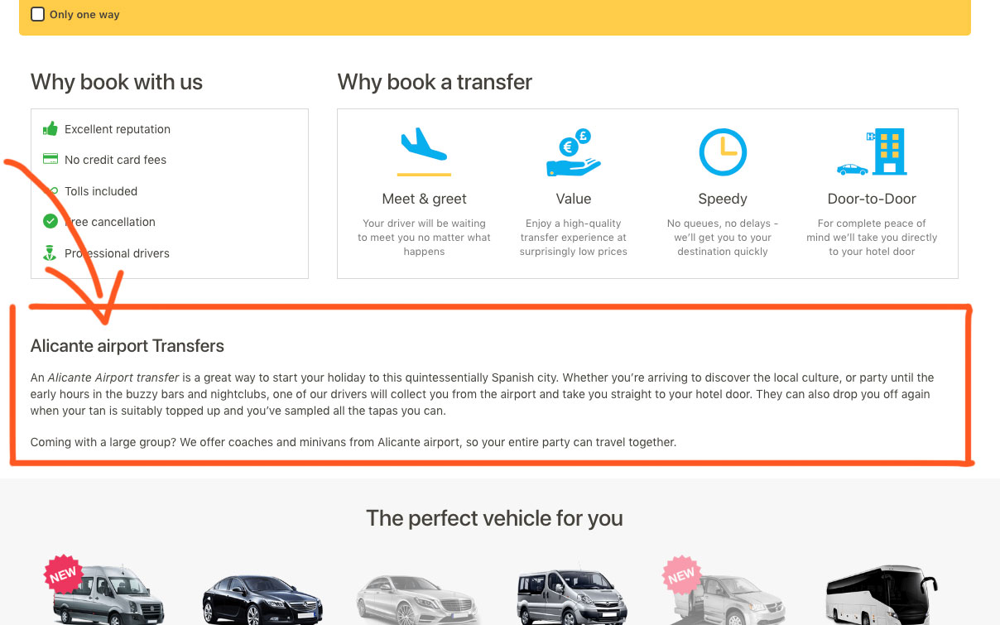

# Landing Pages

!&gt; Due to the SEO strategy, we will include in our landing pages more content, related to that particular page.

## Specification

* At least a block with title and description
* Around 600 words in the scenario of only one block and description
* The possibility of having more than one block in the page \(one component with title and description, then \_smaller\_titles and description\)

## Mobile implementation

* The content can be included in a _"Read more"_ element

## Desktop implementation

* The design of the worst case scenario can be a wall of text in 2 columns

## Considerations

* Use the revamp design of this module as a base for the new implementation

## Deliverables

One mockup in every type of landing page \(Homepage, Airport, Routes\) and their devices \(mobile, tablet, desktop\) for:

* Worst case scenario \(one module\)
* Two different modules with the number of words divided

